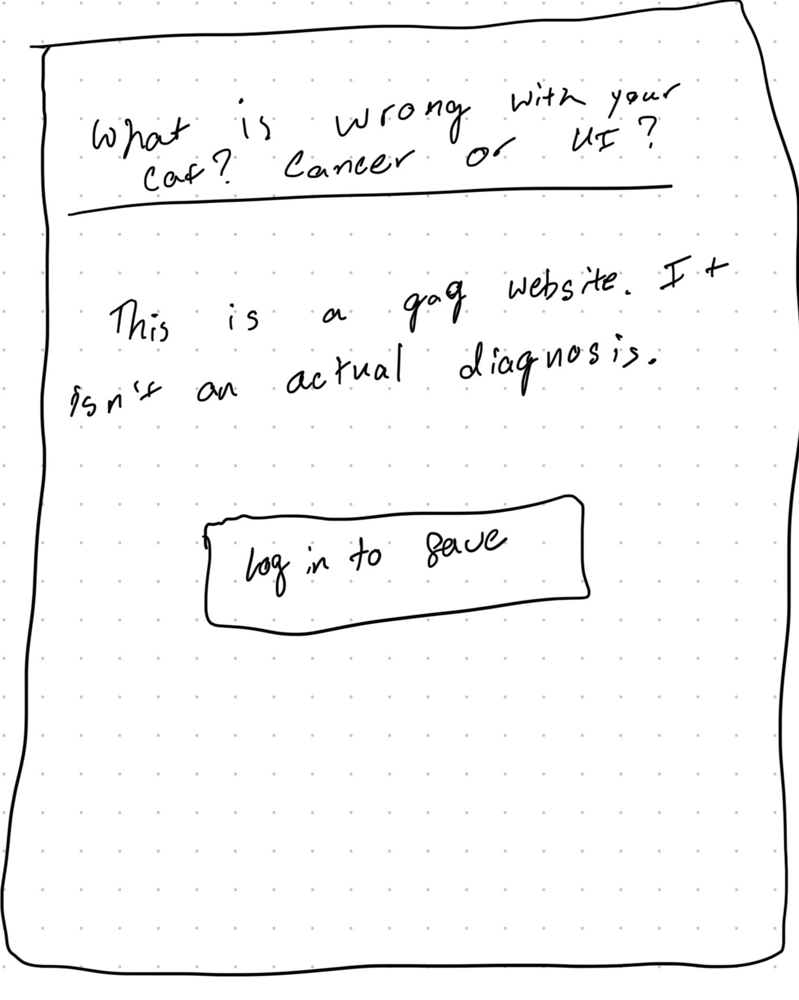
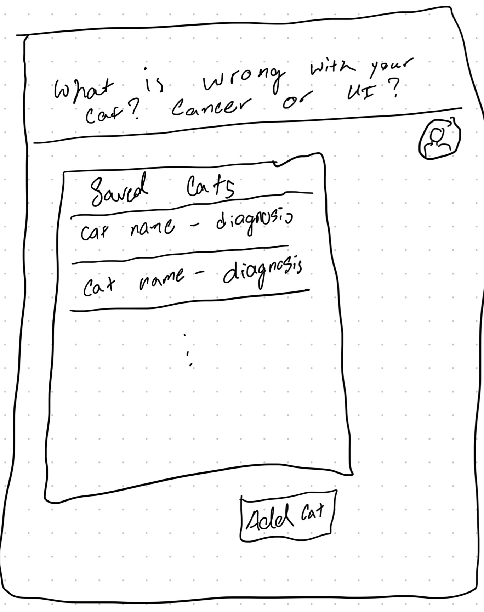
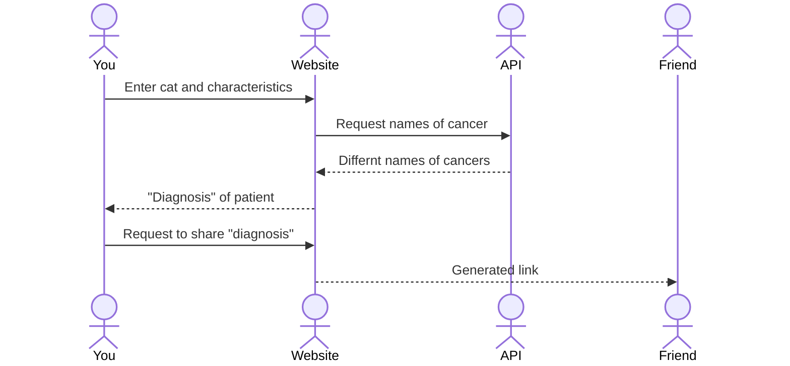

# Cancer or UI (cat diagnosis)

[My Notes](notes.md)

A brief description of the application here. This is a gag cite dedicated to given poor diagnoses for cats based on inputs from the user. There are a few different types of cancer taken from a repository of cancer types. There are only two types of diagnosis, cancer (with type) or UI. This is based off a real experience that my family had where the vets gave different diagnoses but none of it was helpful or reliable.

## 🚀 Specification Deliverable

For this deliverable I did the following. I checked the box `[x]` and added a description for things I completed.

- [x] Proper use of Markdown
- [x] A concise and compelling elevator pitch
- [x] Description of key features
- [x] Description of how you will use each technology
- [x] One or more rough sketches of your application. Images must be embedded in this file using Markdown image references.

### Elevator Pitch

This is a website made for fun and experience but still trying to bring attention to the lack of focus on pet healthcare. Healthcare for humans has to be correct for the sake of a person's life but petcare doesn't have to be as accurate or researched. While many people are attached to their pets, these pets are not as important to them as the lives of their parents but that doesn't mean that the healthcare can be unreliable. This website has to the goal to bring attention to how bad their diagnoses can be.

### Design

> This is a sketch of what it will look like before logging in or entering information

  
> This is a sketch of it after logging in
  

 

### Key features

- Sign in to save cat information and fake diagnosis
- Save name of cat, discription of symtoms, and characteristics (age, color, etc)
- Generate diagnosis from symtoms
- Get names of diagnosis from database through API
- Ability to change cat's information and get new "diagnosis"
- Allows to share diagnosis with others
- Diagnosis will have warning that it isn't an actuall diagnosis and is purely for fun

### Technologies

I am going to use the required technologies in the following ways.

- **HTML** - Create 4 screens: one before logging in, one for logging in, one for after logging in, and one to eneter cat's information
- **CSS** - Application styling that looks good on different screen sizes, uses good whitespace, color choice and contrast
- **React** - Provides login, choice display, applying votes, display other users votes, and use of React for routing and components
- **Service** - functions for things such as:
    - generate diagnosis
    - collect names of cancers
    - decided if it is cancer or not
    - login and register account
    - retrieve saved cat information
    - enter new cat information
- **DB/Login** - Store cat characteristics and diagnosis in database. Register and login users.
- **WebSocket** - When a diagnosis is shared, the information is generated from the server

## 🚀 AWS deliverable

For this deliverable I did the following. I checked the box `[x]` and added a description for things I completed.

- [x] **Server deployed and accessible with custom domain name** - [My server link](https://seanathncs260.click).

## 🚀 HTML deliverable

For this deliverable I did the following. I checked the box `[x]` and added a description for things I completed.

- [x] **HTML pages** - 5 pages made
- [x] **Proper HTML element usage** - Adjustments may be needed but there is a large amount of html elements used
- [x] **Links** - links to other html and github
- [x] **Text** - about.html has information in form of text
- [x] **3rd party API placeholder** - this is the diagnosis at the results.html
- [x] **Images**
- [x] **Login placeholder** - there is a space to enter password and email
- [x] **DB data placeholder** - there is a table that is somewhat poorly created but it is just a placeholder for the data base
- [x] **WebSocket placeholder** - there is a button to share the results in results.html that is not properly set up

## 🚀 CSS deliverable

For this deliverable I did the following. I checked the box `[x]` and added a description for things I completed.

- [x] **Header, footer, and main content body** - They exist idk what else to put
- [x] **Navigation elements** - You can access every page, due to there being two homes one is the home button and the other is the name at the top.
- [x] **Responsive to window resizing** - One page doesn't reformat the best but they still work
- [x] **Application elements** - Using a few classes made in css.
- [x] **Application text content** 
- [x] **Application images** - There is an image in the about section

## 🚀 React part 1: Routing deliverable

For this deliverable I did the following. I checked the box `[x]` and added a description for things I completed.

- [x] **Bundled using Vite**
- [x] **Components** - Some of the html got screwed up because of the way that I made it previously but for this assignement it should be fine for now.
- [x] **Router** - Routing between login and voting components.

## 🚀 React part 2: Reactivity

For this deliverable I did the following. I checked the box `[x]` and added a description for things I completed.

- [x] **All functionality implemented or mocked out** - may want to change how it allows for multiple cats of the same name. This isn't necessarily needed depending on how I use the database, how I incode the data.
- [x] **Hooks** - used in home.jsx to show the table of cats.

## 🚀 Service deliverable

For this deliverable I did the following. I checked the box `[x]` and added a description for things I completed.

- [x] **Node.js/Express HTTP service** - Used these to make api calls
- [x] **Static middleware for frontend** - Used for login
- [x] **Calls to third party endpoints** - Call to get cancer/disease names
- [x] **Backend service endpoints** - Created these to move around cat information
- [x] **Frontend calls service endpoints** - Used to access of cat information and user info

## 🚀 DB/Login deliverable

For this deliverable I did the following. I checked the box `[x]` and added a description for things I completed.

- [x] **User registration** - User's information is stored in the DB
- [x] **User login and logout** - User can login and logout and this affects the app
- [x] **Stores data in MongoDB** - Stores the user's cat information
- [x] **Stores credentials in MongoDB** - The user's cats don't overlap and each user has their own set
- [x] **Restricts functionality based on authentication** - User's can't view other's tables without signing into their accounts

## 🚀 WebSocket deliverable

For this deliverable I did the following. I checked the box `[x]` and added a description for things I completed.

- [ ] **Backend listens for WebSocket connection** - I did not complete this part of the deliverable.
- [ ] **Frontend makes WebSocket connection** - I did not complete this part of the deliverable.
- [ ] **Data sent over WebSocket connection** - I did not complete this part of the deliverable.
- [ ] **WebSocket data displayed** - I did not complete this part of the deliverable.
- [ ] **Application is fully functional** - I did not complete this part of the deliverable.
